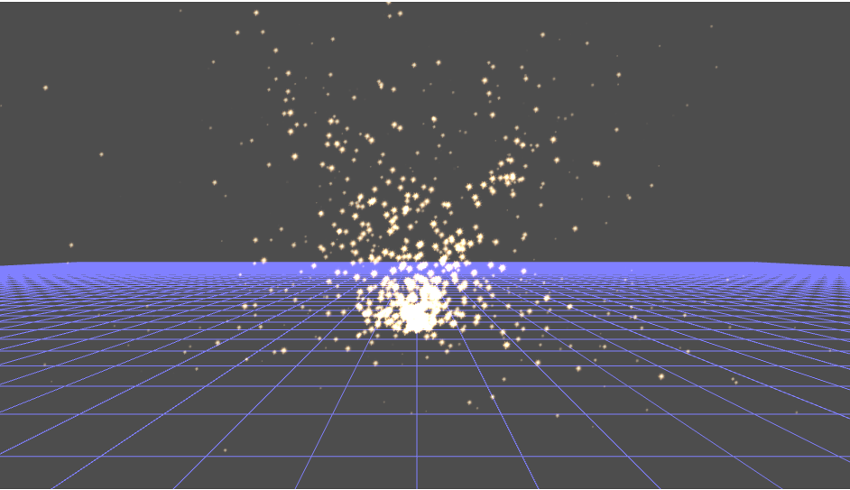

Graphics-Engine-WebGL
=====================
This WebGL engine currently provides the following functionality for creating a WebGL application:
### Basic WebGL context management
 * Asynchronous startup to accommodate asynchronous resource loading. 
 
### Shader management
 * Each shader program is wrapped as an independet object.
 * Shader are asynchronous loaded using `XMLHttpRequest`
 
### Camera control
 * Each camera is wrapped as an independet object.
 * FPS-style and Look-toward-center camera control.
 
### User interaction 
 * Each camera is wrapped as an independet object.
 
 
How to  run:
====================
* There is a ``view.html`` to show how to use the engine.

* Since this engine loads resources asynchronous via AJAX, either running the engine under a locally-run HTTP server, or
doing the following if you want to run it in file mode:
 * Firefox: change ``strict_origin_policy`` to false in about:config
 * Chrome: run Chrome with the argument: `--allow-file-access-from-files--`

How to code:
=========================
* Create a javascript main function taking canvas id and message id as arguments
* There is a CIS700WEBGLCORE global object, this object is used to:
 * Obtain a WebGL context
 * Create shader
 * Create Camera
 * Create Interactor
 * Register callback functions for events like completing asynchronous resource loading
* You need to hook a custom-made render loop and a drawing function to CIS700WEBGLCORE.
* Currently you have to directly use WebGL API for geometry and vertex buffer creation.

Particle system sample
=======================
* Currently the demo view.html features a simple particle system, used to demo how to manage multiple shader programs.
* This simple particle system is purely simulated in CPU.

